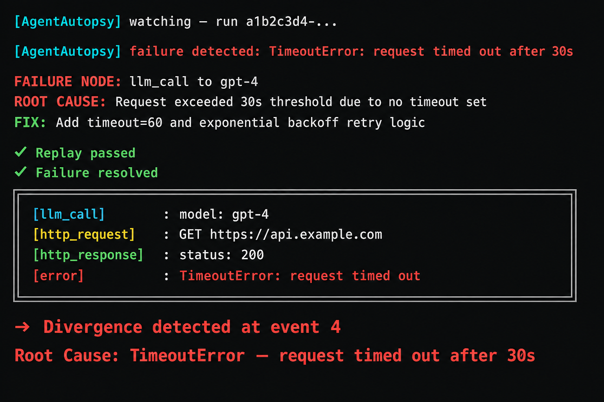

# AgentAutopsy

> When your agent fails, this tells you exactly why.




## CLI

agentautopsy runs        # see all agent runs
agentautopsy replay <id> # replay any failure
agentautopsy stats       # fix cache stats

## Install

```bash
pip install agentautopsy
```

## Usage

```python
import agentautopsy
agentautopsy.watch()
# your existing agent code here — nothing else changes
```

AgentAutopsy automatically intercepts every LLM call, detects failures, finds root cause, outputs a verified fix, and caches it for next time.

## Setup

Windows: `set ANTHROPIC_API_KEY=your-key-here`
Mac/Linux: `export ANTHROPIC_API_KEY=your-key-here`
Get your free key at console.anthropic.com

## Quick start

Create test_agent.py and paste this:

```python
import agentautopsy
agentautopsy.watch()
```

Run: `python test_agent.py`

## Works with

OpenAI, Anthropic, LangChain, any framework using openai or anthropic

## Requirements

Python 3.11+, ANTHROPIC_API_KEY

## License

Apache 2.0
