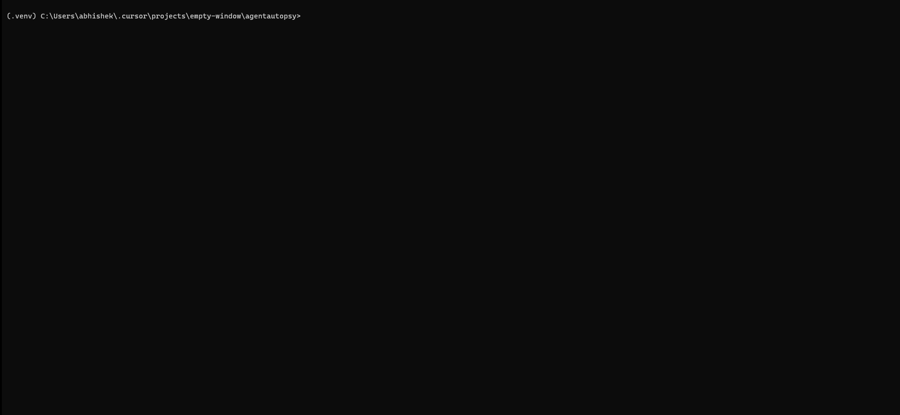

# AgentAutopsy

[](https://github.com/Abhisekhpatel/AgentAutopsy/actions/workflows/ci.yml)
[](https://pypi.org/project/agentautopsy/)
[](https://pypi.org/project/agentautopsy/)
[](https://github.com/Abhisekhpatel/AgentAutopsy)
[](https://opensource.org/licenses/MIT)
[](https://www.python.org/downloads/)

> When your agent fails, this tells you exactly why.

## Install

```bash
pip install agentautopsy
```

## Features

- **LLM interceptor** — Monkey-patches OpenAI and Anthropic calls; records every prompt, response, and error
- **HTTP interceptor** — Captures outbound HTTP requests, responses, and connection failures (`http_error` events)
- **Zero-config watch** — One line (`import agentautopsy.auto` or `agentautopsy.watch()`) instruments your existing agent code
- **MCP proxy tracing** — Natively intercepts and parses JSON-RPC streams between Claude Desktop and your MCP servers
- **SQLite trace store** — Persists full decision traces locally in `agentautopsy.db`
- **Cassette recording** — Serializes LLM responses for offline replay
- **Failure detection** — Finds the exact failing step in a run
- **Root-cause analysis** — AI-powered diagnosis with concrete fix suggestions (Anthropic)
- **Fix cache** — Remembers verified fixes so repeat failures resolve instantly
- **Replay** — Step through failed runs in the CLI and web UI (`agentautopsy replay <run_id>`)
- **Web UI** — Local dashboard with event timeline, stats, and debug chat (`agentautopsy ui`)
- **Auto-fix** — Applies patch suggestions to your codebase (`agentautopsy fix <run_id>`)
- **GitHub PR** — Opens a pull request with the proposed fix (`agentautopsy fix <run_id> --create-pr`)
- **Slack alerts** — Notifies your channel when a run fails (`AGENTAUTOPSY_SLACK_WEBHOOK`)
- **Prompt diffing** — Compares prompts in the current run vs. the previous run
- **Divergence detection** — Flags when a run behaves differently from past successful runs
- **Multi-agent graph** — Visualizes parent/child runs and agent chains (`agentautopsy agents`)
- **Share/export** — Export a run trace to JSON (`agentautopsy share <run_id>`)
- **LangChain support** — `get_callback_handler()` for LangChain callbacks
- **LangGraph support** — `get_langgraph_handler()` for node, edge, and state tracing
- **CrewAI support** — `get_crewai_handler()` for task, tool, and handoff tracing
- **GitHub Actions** — Posts root cause + fix on PR test failures

## What it does

**Before (broken agent)**

```
Traceback (most recent call last):
  File "agent.py", line 42, in run
    response = client.chat.completions.create(...)
openai.APIConnectionError: Connection error.
```

No context. No failing step. No fix.

**After (with AgentAutopsy)**

```
POST /v1/chat/completions
POST /v1/chat/completions
ERROR: APIConnectionError
Root cause: OpenAI connection failed
Run status: failed

FAILURE NODE: HTTP call to OpenAI chat completions
ROOT CAUSE: Network connection to api.openai.com failed after retries
FIX: Add timeout=60, max_retries=3, and verify OPENAI_API_KEY / network access
```

AgentAutopsy captures the full trace, pinpoints the failure, explains why it happened, and suggests a verified fix.

## Why this exists

Every time an AI agent fails, you get a useless stack trace.
No context. No reason. No fix.
AgentAutopsy gives you the exact failure step, root cause,
and a verified fix — automatically.




## CLI

agentautopsy runs        # see all agent runs
agentautopsy replay <id> # replay any failure
agentautopsy mcp <cmd>   # transparently proxy and trace an MCP server via stdio
agentautopsy stats       # fix cache stats

## GitHub Actions

Add AgentAutopsy to your test workflow so failed Python tests get an automatic root-cause analysis and a suggested fix posted on the pull request.

Create or update `.github/workflows/test.yml`:

```yaml
name: Tests

on:
  pull_request:
  push:
    branches: [main]

jobs:
  test:
    runs-on: ubuntu-latest
    steps:
      - uses: actions/checkout@v4

      - uses: actions/setup-python@v5
        with:
          python-version: "3.10"

      - name: Install dependencies
        run: pip install -r requirements.txt

      - name: AgentAutopsy
        uses: Abhisekhpatel/AgentAutopsy@v1
        with:
          anthropic_api_key: ${{ secrets.ANTHROPIC_API_KEY }}
          github_token: ${{ secrets.GITHUB_TOKEN }}
          test_command: pytest
```

**Inputs**

| Input | Required | Default | Description |
|-------|----------|---------|-------------|
| `anthropic_api_key` | yes | — | Anthropic API key for analysis |
| `github_token` | yes | — | Token with `pull-requests: write` (use `secrets.GITHUB_TOKEN`) |
| `test_command` | no | `pytest` | Shell command run before analysis |

On test failure the action runs `agentautopsy analyze` (via the bundled entrypoint), then posts **root cause** and **fix** as a PR comment. Store `ANTHROPIC_API_KEY` in repository secrets.

## Examples

```python
# Basic usage
import agentautopsy
agentautopsy.watch()

# LangChain
from agentautopsy import get_callback_handler
handler = get_callback_handler()
agent.run(input, config={"callbacks": [handler]})

# LangGraph
from agentautopsy import get_langgraph_handler
handler = get_langgraph_handler()
graph.invoke(input, config={"callbacks": [handler]})

# CrewAI
from agentautopsy import get_crewai_handler
handler = get_crewai_handler()
crew = Crew(agents=[...], callbacks=[handler])
```

```bash
# Slack alerts
export AGENTAUTOPSY_SLACK_WEBHOOK=https://hooks.slack.com/...

# Web UI
agentautopsy ui

# CLI
agentautopsy runs
agentautopsy replay <run_id>
agentautopsy stats
```

## LangGraph

```python
import agentautopsy
from agentautopsy import get_langgraph_handler

agentautopsy.watch()
handler = get_langgraph_handler()

# Pass the handler into LangGraph invoke config
result = graph.invoke(
    {"messages": [("user", "research competitors")]},
    config={"callbacks": [handler]},
)
```

The handler records node start/end, edge traversals, state updates between nodes, tool and LLM activity, and any graph errors in `agentautopsy.db`.

## CrewAI

```python
import agentautopsy
from agentautopsy import get_crewai_handler
from crewai import Crew

agentautopsy.watch()
handler = get_crewai_handler()

crew = Crew(agents=[researcher, writer], tasks=[...], callbacks=[handler])
crew.kickoff()

# Or use step_callback on Crew / Agent (supported by current CrewAI releases)
crew = Crew(agents=[...], step_callback=handler.step_callback)
```

The handler records task start/end, tool usage, agent handoffs, final crew output, and errors.

## Usage

```python
import agentautopsy.auto
# your existing agent code here — nothing else changes
```

AgentAutopsy automatically intercepts every LLM call, detects failures, finds root cause, outputs a verified fix, and caches it for next time.

## Why AgentAutopsy vs LangSmith / Helicone?

| Feature | AgentAutopsy | LangSmith | Helicone |
|---------|-------------|-----------|----------|
| Works offline | ✅ | ❌ | ❌ |
| Zero config | ✅ | ❌ | ❌ |
| Replay failed runs | ✅ | partial | ❌ |
| AI debug assistant | ✅ | ❌ | ❌ |
| Prompt diffing | ✅ | partial | ❌ |
| Divergence detection | ✅ | ❌ | ❌ |
| Free and open source | ✅ | partial | ✅ |
| No cloud required | ✅ | ❌ | ❌ |

## Setup

Windows: `set ANTHROPIC_API_KEY=your-key-here`
Mac/Linux: `export ANTHROPIC_API_KEY=your-key-here`
Get your free key at console.anthropic.com

Set `AGENTAUTOPSY_SLACK_WEBHOOK=your-webhook-url` and AgentAutopsy will automatically alert your Slack channel when any agent fails.

## Quick start

```bash
pip install agentautopsy
```

Create test_agent.py and paste this:

```python
import agentautopsy.auto
```

Run: `python test_agent.py`

### Trace Model Context Protocol (MCP) Servers
If you are building an MCP server for Claude Desktop, you can trace all tools being called by running your server through the agentautopsy proxy:

```bash
agentautopsy mcp python my_mcp_server.py
```

The Web UI (`agentautopsy ui`) will elegantly parse and highlight all `mcp_initialize`, `mcp_tool_call` and `mcp_response` JSON payloads in your trace timeline.

## Works with

OpenAI, Anthropic, LangChain, LangGraph, CrewAI, any framework using openai or anthropic

## Requirements

Python 3.8+, `ANTHROPIC_API_KEY` (for AI root-cause analysis)

## License

MIT

## Roadmap

- [ ] VS Code extension
- [x] GitHub Actions integration  
- [x] Multi-agent tracing
- [x] Auto-fix applier
- [x] LangChain support
- [x] LangGraph support
- [x] CrewAI support
- [x] Slack alerts
- [x] Web UI
- [x] Prompt diffing
- [x] Divergence detection
- [x] MCP Proxy Interceptor
