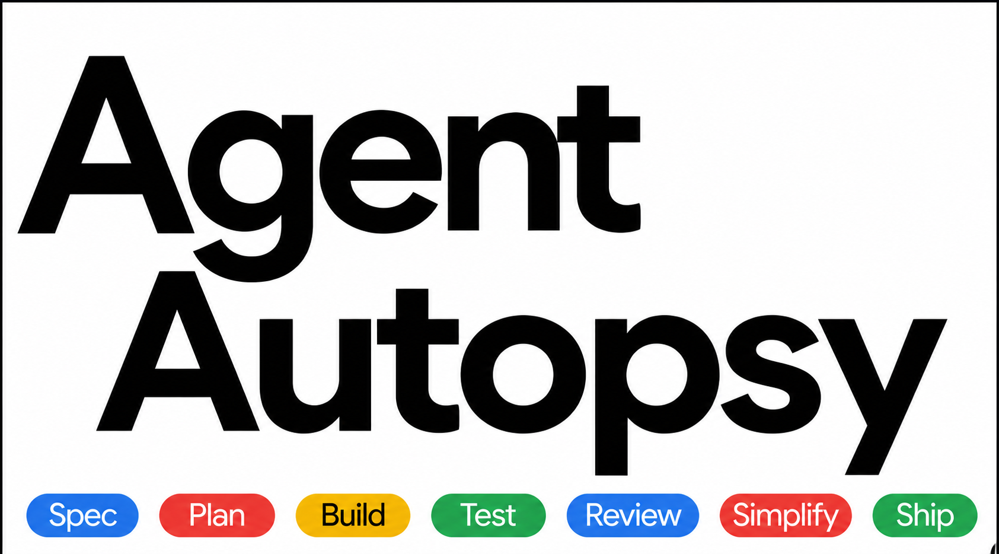

[](https://pypi.org/project/agentautopsy/)
[](https://pepy.tech/project/agentautopsy)
[](https://github.com/Abhisekhpatel/AgentAutopsy)
[](https://opensource.org/licenses/MIT)
[](https://www.python.org/downloads/)

The post-mortem debugger for AI agents. When your agent fails silently — AgentAutopsy tells you exactly why.

## Lifecycle

```
Install  →  Watch  →  Fail  →  Trace  →  Replay  →  Fix
   │          │        │         │          │        │
 pip      watch()   silent   SQLite     rewind    auto-fix
install              failure   log      + fork    + cache
```

| Stage | What happens |
|-------|--------------|
| **Install** | `pip install agentautopsy` — no cloud account, no config file |
| **Watch** | `agentautopsy.watch()` intercepts LLM, HTTP, MCP, and tool calls |
| **Fail** | Agent errors or returns bad output; run is marked in local SQLite |
| **Trace** | Full event timeline: prompts, tools, schemas, tokens, timestamps |
| **Replay** | Rewind to any step, fork with new input, diff original vs replay |
| **Fix** | Root-cause report, AI chat on trace, verified fix cached for next run |

## Commands

| What you're doing | Command | Key principle |
|-------------------|---------|---------------|
| Zero config setup | `agentautopsy.watch()` | One import catches everything |
| View trace UI | `agentautopsy ui` | Visual timeline of every step |
| Replay a failure | `agentautopsy replay --run-id <id> --from-step <n>` | Rewind to exact failure point |
| Detect schema drift | `SchemaDriftDetector().watch()` | Catch API changes before production |
| Trace MCP servers | `MCPAutopsy().watch_mcp_server()` | Every MCP call recorded |
| Fork and fix | `DVRReplay().fork(run_id, at_step=3)` | Branch from any step |
| Generate tests from failures | `agentautopsy generate-evals` | Never fix the same bug twice |

## Quick Start

```bash
pip install agentautopsy
```

```python
import agentautopsy

agentautopsy.watch()
# your existing agent code — nothing else changes
```

## Features

| Feature | What It Does | Use When |
|---------|--------------|----------|
| **MCP Post-Mortem Tracing** | Traces every MCP server call, shows bad data source | Using Claude Code, Cursor, any MCP client |
| **Schema Drift Detector** | Detects renamed/removed/added fields automatically | After any API or tool upgrade |
| **DVR Fork and Replay** | Rewind, replay, fork from any step | Debugging production failures |
| **Swarm Tracing** | Causality tracing across 50+ agents | Multi-agent workflows |
| **AI Chat on Trace** | Ask questions about your failure | When root cause is unclear |
| **Prompt Diffing** | Compare runs side by side | Optimizing agent behavior |
| **Automatic Eval Generation** | Generates pytest test cases from every failure automatically | When you want to make sure the same failure never happens again |

## Framework Support

Works with: LangChain, LangGraph, CrewAI, AutoGen, LlamaIndex, OpenAI, Anthropic, MCP

## Module Quick Start

### Basic

```python
import agentautopsy

agentautopsy.watch()
```

### MCP

```python
from agentautopsy import MCPAutopsy

MCPAutopsy().watch_mcp_server("my-mcp-server")
```

### Schema Drift

```python
from agentautopsy import SchemaDriftDetector

SchemaDriftDetector().watch()
```

### DVR Replay

```python
from agentautopsy import DVRReplay

dvr = DVRReplay()
dvr.replay(run_id, from_step=3)
dvr.fork(run_id, at_step=3, new_input={"query": "fixed prompt"})
```

### Auto Eval Generation

```python
from agentautopsy import EvalGenerator

gen = EvalGenerator()
gen.generate_all()  # generates tests from all recorded failures
```

## Contributing

Fork the repo, open a PR with tests. See [CONTRIBUTING.md](CONTRIBUTING.md) for setup and CI commands.

## License

MIT — see [LICENSE](LICENSE).
